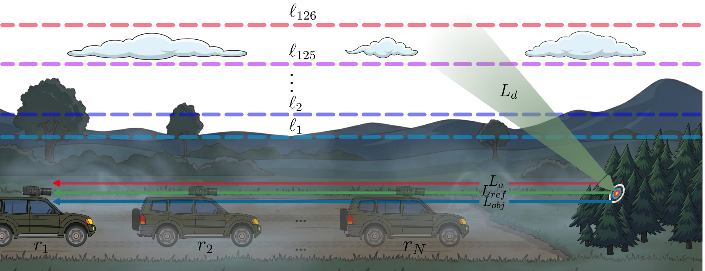

# Set-Based Transformer for Atmospheric Compensation in Standoff LWIR Hyperspectral Imaging

<div align="center">

[](https://factral.github.io/SAE-LWIR)
[](LICENSE)

</div>

<div>
  <p align="center" style="font-size: larger;">
    <strong>IGARSS 2026 — Oral Presentation</strong>
  </p>
</div>

<div align="center">
  
  <br>

  <div align="center">

**[Fabian Perez](https://www.factral.co/)¹ · Nicolas Quintero¹ · Jeferson Acevedo¹ · [Hoover Rueda-Chacón](https://www.hfarueda.com/)¹**

¹Universidad Industrial de Santander, Bucaramanga, Colombia

</div>

**TL;DR:** We propose a lightweight set-based deep learning framework that jointly processes radiance measurements acquired at multiple standoff ranges to estimate transmittance, atmospheric path radiance (upwelling), and a shared downwelling spectrum for atmospheric compensation in standoff LWIR hyperspectral imaging — and we probe its latent space with a sparse autoencoder, revealing geographically coherent features learned without any location supervision.

</div>

---

## 📖 Abstract

Passive long-wave infrared (LWIR) hyperspectral imaging under a standoff geometry depends on atmospheric absorption and emission, as well as reflected radiance, thus making atmospheric compensation essential to get knowledge of a target of interest. Despite its importance, this compensation has been largely overlooked due to its practical and modeling difficulty. In this paper, we present a **lightweight set-based deep learning framework** that takes multiple radiance measurements, collected at different standoff ranges, as input and jointly estimates transmittance, atmospheric path radiance, and a shared downwelling spectrum. We analyze the learned representation with a **sparse autoencoder** and observe that several latent features do activate on geographically coherent subsets of the test data despite the absence of location supervision. Experiments on a MODTRAN generated standoff LWIR dataset demonstrate low spectral distortion across all estimated products. The dataset and code will be made publicly available.

## 🛠️ Installation

The project uses [uv](https://docs.astral.sh/uv/) for environment management (Python 3.10). You need a GPU to train the models.

### 1. Clone this Repository

```bash
git clone https://github.com/Factral/SAE-LWIR
cd SAE-LWIR
```

### 2. Install Dependencies

```bash
uv sync
```

This creates a `.venv` with all pinned dependencies (PyTorch 2.9.1, CUDA 12).

## 📁 Data Format

The dataset is a MODTRAN5-generated standoff LWIR collection built from **36,547 clear-sky atmospheric profiles** (filtered from the ERA5-derived CSP database), simulated at **7 standoff ranges** R = {30, 90, 150, 210, 270, 330, 390} m and **7 target temperatures** T = {280, …, 310} K, for a total of **255,829 samples** with **B = 256 spectral bands** over the 8–13 µm LWIR window (Gaussian ISRF, FWHM = 40 nm).

### Required Data Structure

```
data/
├── forward.npy          # At-sensor radiance      (36547, 7, 7, 256)  [profiles, temps, ranges, bands]
├── transmittance.npy    # Transmittance τ         (36547, 7, 256)     [profiles, ranges, bands]
├── upwelling.npy        # Path radiance L_a       (36547, 7, 256)     [profiles, ranges, bands]
└── downwelling.npy      # Downwelling L_d         (36547, 256)        [profiles, bands]
```

- **Value units**: radiance in microflicks (µW·sr⁻¹·cm⁻²·µm⁻¹)
- **Splits**: 70% train / 10% validation / 20% test (random, fixed seed)

### 📊 Dataset

The dataset download link will be made available on the [project page](https://factral.github.io/SAE-LWIR).

## 🎯 Usage

### Training the Set-Based Network

```bash
uv run python -m framework.run \
  --data_dir data \
  --set_size 7 \
  --dim 256 \
  --batch_size 512 \
  --lr 1e-3 \
  --epochs 500 \
  --run_name trial
```

The best checkpoint is saved to `results/set_transformer/<run_name>/best_model.pt`.

### Key Parameters

| Parameter | Description | Default |
|-----------|-------------|---------|
| `--set_size` | Number of standoff measurements N per set | 7 |
| `--dim` | Encoder embedding size d | 256 |
| `--batch_size` | Training batch size | 512 |
| `--lr` | Learning rate (AdamW) | 1e-3 |
| `--weight_decay` | AdamW weight decay | 0.01 |
| `--epochs` | Training epochs | 500 |

### Training the Sparse Autoencoder

Once the base model is trained, train the SAE on its frozen encoder activations:

```bash
uv run python -m sae.main
```

SAE hyperparameters (dictionary size, TopK gating `k`, learning rate, SAE variant `vanilla|topk|batchtopk|jumprelu`) are configured in `sae/config.py`. Checkpoints are saved to `checkpoints/`.

### Evaluation

```bash
bash scripts/test.sh
```

This evaluates the trained model on the test split and writes qualitative prediction plots to `test_results/`.

## 📈 Results

Test-set performance for the three estimated atmospheric compensation products:

| N | Target | SAM ↓ | NRMSE ↓ |
|---|--------|------:|--------:|
| 1 | Transmittance | 0.0057 | 0.0554 |
| 1 | Upwelling     | 0.1244 | 0.0564 |
| 1 | Downwelling   | 0.1937 | 0.1740 |
| 7 | Transmittance | **0.0025** | **0.0093** |
| 7 | Upwelling     | **0.0330** | **0.0093** |
| 7 | Downwelling   | **0.0409** | **0.0193** |

## 🔍 SAE Interpretability Analysis

Use the provided scripts in the `scripts/` directory to reproduce the SAE analyses:

```bash
# Per-feature activation histograms and statistics
bash scripts/sae.sh

# Cluster SAE features and visualize top-activating examples
bash scripts/2sae.sh

# Row-wise (per standoff range) activation distributions
bash scripts/3sae.sh

# Top-activating samples per feature with geospatial maps
bash scripts/4.sh

# Feature saturation / ablation effect on model outputs
bash scripts/5.sh
```

Each script points to the trained base model and SAE checkpoints and writes figures to its own output directory.

## 🎓 Citation

If you find this work useful, please cite our paper:

```bibtex
@inproceedings{perez2026setbased,
  title={Set-Based Transformer for Atmospheric Compensation in Standoff LWIR Hyperspectral Imaging},
  author={Perez, Fabian and Quintero, Nicolas and Acevedo, Jeferson and Rueda-Chac{\'o}n, Hoover},
  booktitle={IGARSS 2026 - IEEE International Geoscience and Remote Sensing Symposium},
  year={2026}
}
```

## 🙏 Acknowledgments

- This work was supported by the Air Force Office of Scientific Research (AFOSR) through the Southern Office of Aerospace Research and Development (SOARD) under grant number FA8655-25-1-8010
- Set Transformer modules built upon the [official implementation](https://github.com/juho-lee/set_transformer)
- SAE implementations based on [BatchTopK](https://github.com/bartbussmann/BatchTopK)

---

<div align="center">
  <b>🌟 Star this repository if you find it useful! 🌟</b>
</div>
